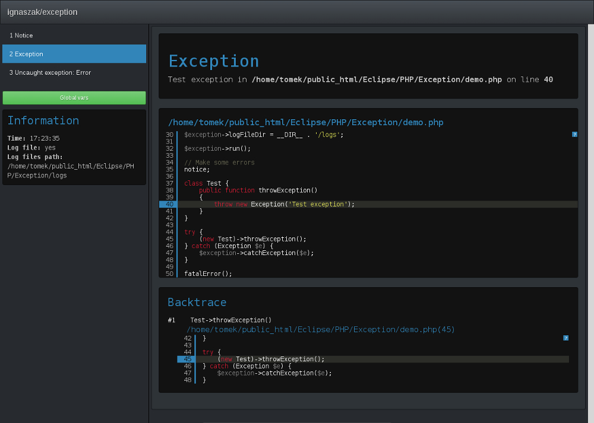

# ignaszak/exception

This package provides error handler interface



## Installing

The package is avilable via [Composer/Packagist](https://packagist.org/packages/ignaszak/exception), so just add following lines to your composer.json file:

```json
"require" : {
    "ignaszak/exception" : "*"
}
```

or:

```sh
php composer.phar require ignaszak/exception
```

## Running Tests

Just run phpunit from the working directory

```sh
php phpunit.phar
```

## Requirments

php >= 7.0

## Example

```php
include __DIR__ . '/autoload.php';

$exception = new Ignaszak\Exception\Start;

// Set which PHP errors are reported
$exception->errorReporting = E_ALL;

// Set display mode if error occured:
//    'dev'      - full developer error interface
//    'user'     - simple message for users
//    'location' - redirect to oder site with custom error message
//    'none'     - set no display
$exception->display = 'dev';

// Set which PHP errors are displayed in 'user' or 'location' mode
$exception->userReporting = E_ALL & ~E_NOTICE;

// Set message for 'user' mode
$exception->userMessage = 'Error occured.';

// Set location adress for 'location' mode
$exception->userLocation = 'http://example.com';

// Create log file if error occured
$exception->createLogFile = true;

// Log files dir
$exception->logFileDir = __DIR__ . '/logs';

$exception->run();

// Make some errors
notice;

class Test {
    public function throwException()
    {
        throw new Exception('Test exception');
    }
}

try {
    (new Test)->throwException();
} catch (Exception $e) {
    $exception->catchException($e);
}

fatalError();
```